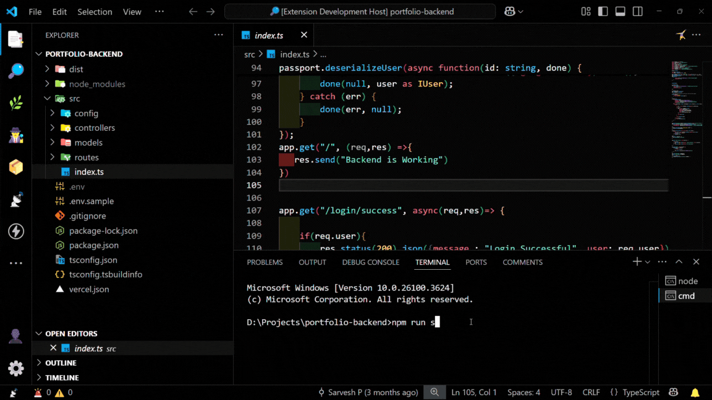

# Kill Switch - VS Code Extension  

Kill Switch is a VS Code extension that allows users to quickly kill processes running on a specified port using the search bar.  

## Features  

- **Kill Process by Port**: Enter a port number in the search bar to terminate processes running on it.  
- **Cross-Platform Support**: Works on Windows (PowerShell) and macOS/Linux (lsof & kill commands).  
- **Lightweight & Fast**: No additional dependencies required.  

## How to Use  

1. Open the **VS Code search bar** (`Ctrl + P` or `Cmd + P` on Mac).  
2. Type `>` to enter command mode.  
3. Search for `Kill Switch: Kill Process in Port`.  
4. Enter the port number (e.g., `3000`).  
5. If a process is running on the specified port, it will be terminated.  

## Requirements  

- **Windows**: Requires PowerShell for process termination.  
- **macOS/Linux**: Requires `lsof` and `kill`.  

## Extension Settings  

This extension does not require any additional settings.  

## Known Issues  

- Ensure that PowerShell is installed and accessible on Windows.  
- For macOS/Linux, `lsof` must be installed.  

## Release Notes  

### 1.0.0  
- Initial release with search bar integration for killing processes by port.  

## Future Updates  

- Adding sidebar integration if needed.  
- Displaying process details before termination.  

## Video Tutorial  

  

---

For more details, visit the [VS Code API documentation](https://code.visualstudio.com/api/references/extension-guidelines).  

**Enjoy using Kill Switch! 🚀**  
